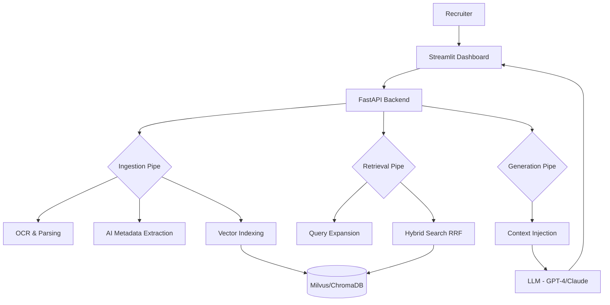

# 🎯 Talent Screen — Enterprise AI Recruitment Assistant

[](https://fastapi.tiangolo.com/)
[](https://streamlit.io/)
[](https://milvus.io/)
[](https://www.docker.com/)

**Talent Screen** is a production-grade Recruitment Assistant powered by Retrieval-Augmented Generation (RAG). It transforms traditional ATS keyword-based search into a deep semantic talent discovery engine, helping recruiters find the right talent 80% faster.

---

## 🚀 Key Features

### 🔍 Intelligent Retrieval
- **Hybrid Search**: Combines **BM25 Keyword Matching** with **Dense Vector Search** using Reciprocal Rank Fusion (RRF).
- **AI Query Expansion**: Automatically expands recruiter queries into full technical tech stacks to find "hidden" candidates.
- **Semantic Understanding**: Finds "ML Engineers" even if the resume only says "Deep Learning Developer."

### 🤖 AI Recruiter Assistant
- **Context-Grounded Chat**: Ask questions like *"Who has the most experience with AWS Bedrock?"* or *"Compare candidate A and B for a Lead React role."*
- **Streaming Responses**: Real-time interactive feedback for a fluid recruiter experience.
- **PII Protection**: Automatically masks sensitive candidate data (emails, phones) in AI responses.

### 📊 Enterprise Backend
- **Asynchronous Ingestion**: Multi-threaded processing of PDF/Docx resumes using background workers.
- **Metadata Extraction**: LLM-powered extraction of Skills, Years of Experience, Education, and Domain.
- **Observability**: Detailed logging and tracing using **Loguru** and **Langfuse** integration.

---

## 🏗 System Architecture



---

## 🛠 Tech Stack

| Layer | Technology |
| :--- | :--- |
| **Backend** | Python 3.10, FastAPI, Uvicorn |
| **Frontend** | Streamlit (Glassmorphism Theme) |
| **Orchestration** | LangChain, LangGraph |
| **Vector DB** | Milvus (Production), ChromaDB (POC) |
| **Cache & Audit** | Redis, PostgreSQL |
| **Embeddings** | Sentence Transformers (all-MiniLM-L6-v2) |
| **Models** | OpenAI GPT-4-turbo, Claude 3 (via Bedrock) |

---

## 🚦 Getting Started

### Prerequisites
- Docker & Docker Compose
- OpenAI API Key

### 🐳 Quick Start (Docker)
The easiest way to start the entire enterprise stack:

1. **Clone the repository**:
   ```bash
   git clone <repo-url>
   cd talent-screen
   ```

2. **Configure Environment**:
   Create a `.env` file from the template:
   ```env
   OPENAI_API_KEY=your_key_here
   MILVUS_HOST=milvus
   REDIS_URL=redis://redis:6379/0
   ```

3. **Launch Stack**:
   ```bash
   docker-compose up --build
   ```
   *The backend will be live at `localhost:8000` and the UI at `localhost:8501`.*

---

## 📁 Project Structure

```text
talent-screen/
├── backend/
│   ├── app/
│   │   ├── api/          # API Route handlers
│   │   ├── core/         # Config, Logging, Security, Guardrails
│   │   ├── db/           # Milvus & ChromaDB implementations
│   │   ├── services/     # RAG Pipelines (Retrieval, LLM, Worker)
│   │   └── main.py       # FastAPI Entry point
│   └── ingestion/        # Resume Parsers & Chunkers
├── frontend/
│   └── app.py            # Streamlit Premium Interface
├── scripts/              # Diagnostic & RAG Testing tools
└── docker-compose.yml    # Full-stack orchestration
```

---

## 🔒 Security & Privacy
- **JWT Authentication**: Secure API endpoints for enterprise use.
- **Content Validation**: Prevents prompt injection and malicious queries.
- **GDPR Ready**: Optional PII masking ensures candidate privacy during the screening phase.

---

## 📈 Roadmap
- [ ] Multi-lingual resume support
- [ ] Advanced candidate ranking with custom weights
- [ ] Integration with LinkedIn API / Job Boards
- [ ] Video interview transcription & analysis

---

Developed with ❤️ by **Antigravity AI** for modern Recruitment Teams.
